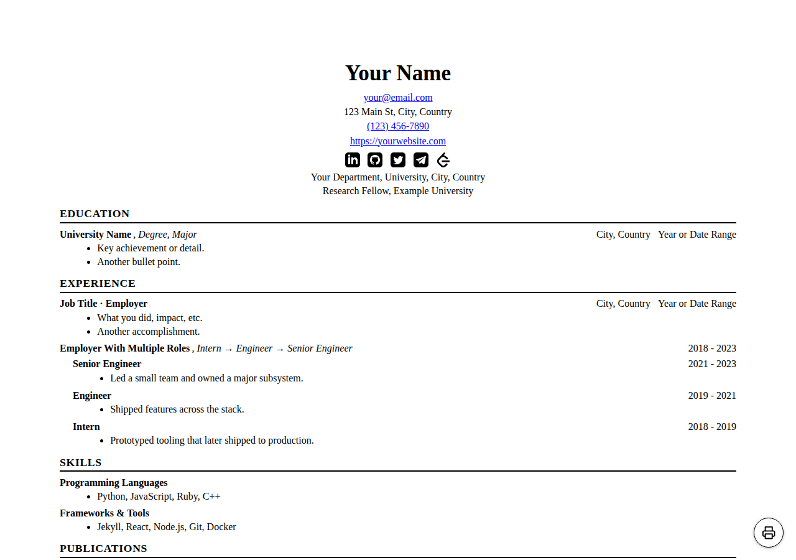

# 🚀 Introducing Harvard-Style Jekyll CV Theme!
Instantly create a professional academic CV with a classic Harvard look—customizable, mobile-friendly, and ready for GitHub Pages.

👉 [Try the demo](https://smirnoffmg.github.io/) | ⭐ Star to support!

---

## 🚀 Quick Start

There are two ways to consume this theme. Then create your own `_config.yml` and
`_data/cv.yml` files with your information.

### Option A — as a gem (recommended; works with private repos)

Package-based consumption builds the theme through Bundler, so it can be pinned
to a tag for reproducible builds and can be fetched from a **private** repository.

`Gemfile`:

```ruby
gem "harvard-style-cv-theme",
    git: "https://github.com/sengine-cloud/harvard-style-cv-theme.git",
    tag: "v1.1.0"
```

`_config.yml`:

```yaml
theme: harvard-style-cv-theme
```

### Option B — as a remote theme (public repos only)

```yaml
remote_theme: sengine-cloud/harvard-style-cv-theme@v1.1.0
```

> ⚠️ **Private repositories:** `jekyll-remote-theme` downloads the theme from
> `codeload.github.com` and sends **no credentials**, so `remote_theme` cannot
> authenticate against a private theme repo — use **Option A** instead, and give
> the consuming site's CI read access to this repo.
>
> The recommended way is **[Octo STS](https://github.com/octo-sts/app)** — OIDC
> federation with *no stored secrets*. Check a trust policy into this repo at
> `.github/chainguard/<identity>.sts.yaml` (see
> [`alex-cv-pages.sts.yaml`](.github/chainguard/alex-cv-pages.sts.yaml)), install
> the [Octo STS app](https://github.com/apps/octo-sts) on this repo, then in the
> consumer's workflow mint a short-lived token and hand it to Bundler:
>
> ```yaml
> permissions:
>   id-token: write   # federate the OIDC token
>   contents: read
> steps:
>   - uses: octo-sts/action@v1
>     id: octo-sts
>     with:
>       scope: sengine-cloud/harvard-style-cv-theme   # this repo
>       identity: alex-cv-pages                        # the .sts.yaml stem
>   - run: >
>       git config --global
>       url."https://x-access-token:${{ steps.octo-sts.outputs.token }}@github.com/".insteadOf
>       "https://github.com/"
> ```
>
> A fine-grained PAT or deploy key works too (drop it into the same `git config`
> line as `x-access-token:${TOKEN}`), but that stores a long-lived secret.

---

## 📝 Configuration Examples

### `_config.yml` - Site Configuration
```yaml
# Basic Information
title: "Dr. Jane Smith"
email: "jane.smith@university.edu"
phone: "(555) 123-4567"
address: "123 Academic Street, Cambridge, MA 02138"
website: "https://janesmith.com"

# Professional Affiliation
department: "Department of Computer Science, Harvard University, Cambridge, MA"
affiliation: "Research Fellow, MIT Computer Science & AI Laboratory"

# Social Media (just usernames, not full URLs)
linkedin: janesmith
github: janesmith
twitter: janesmith
telegram: janesmith
leetcode: janesmith

# Optional: GoatCounter (privacy-friendly; tracks data-goatcounter-click links)
goatcounter: "https://yourcode.goatcounter.com"

# Optional: Google Analytics
google_analytics: G-XXXXXXXXXX

# Optional: Yandex.Metrika (with goal tracking for contact clicks)
yandex_metrika: 12345678

# Site Settings
description: "Harvard-style CV • Dr. Jane Smith"
baseurl: ""
url: "https://janesmith.github.io"
```

### `_data/cv.yml` - CV Content
```yaml
sections:
  - title: Education
    entries:
      - title: "Harvard University"
        sub: "Ph.D. in Computer Science"
        location: "Cambridge, MA"
        dates: "2018-2023"
        bullets:
          - "Dissertation: 'Advanced Machine Learning Algorithms for Natural Language Processing'"
          - "Advisor: Dr. John Doe"
          - "GPA: 3.9/4.0"
      
      - title: "MIT"
        sub: "M.S. in Computer Science"
        location: "Cambridge, MA"
        dates: "2016-2018"
        bullets:
          - "Thesis: 'Neural Network Optimization Techniques'"
          - "Graduated with distinction"

  - title: Experience
    entries:
      - title: "Research Scientist · Google Research"
        location: "Mountain View, CA"
        dates: "2023-Present"
        bullets:
          - "Lead research on large language models and their applications"
          - "Published 5 papers in top-tier conferences (NeurIPS, ICML)"
          - "Mentored 3 PhD students and 2 research interns"
      
      - title: "Graduate Research Assistant · Harvard University"
        location: "Cambridge, MA"
        dates: "2018-2023"
        bullets:
          - "Developed novel algorithms for natural language understanding"
          - "Collaborated with international research teams"
          - "Presented work at 8 international conferences"

  - title: Publications
    entries:
      - title: "Advanced Neural Architectures for Language Processing"
        sub: "NeurIPS 2023"
        bullets:
          - "Proposed a new transformer variant that improves efficiency by 40%"
          - "Cited 150+ times within 6 months of publication"
      
      - title: "Efficient Training Methods for Large Language Models"
        sub: "ICML 2022"
        bullets:
          - "Developed techniques to reduce training time by 60%"
          - "Open-sourced implementation with 500+ GitHub stars"

  - title: Skills
    entries:
      - title: "Programming Languages"
        bullets:
          - "Python, C++, JavaScript, Rust"
      
      - title: "Machine Learning & AI"
        bullets:
          - "PyTorch, TensorFlow, Transformers, Computer Vision"
      
      - title: "Tools & Platforms"
        bullets:
          - "Git, Docker, AWS, Google Cloud Platform"

  - title: Awards & Honors
    entries:
      - title: "NSF Graduate Research Fellowship"
        dates: "2018-2021"
        bullets:
          - "Prestigious fellowship for outstanding graduate students"
      
      - title: "Best Paper Award"
        sub: "ACL 2022"
        bullets:
          - "Recognized for innovative contributions to NLP field"
```

#### Grouping multiple roles at one employer

An entry may carry a `roles:` list to group several positions held at the same
employer. Each role renders as a nested entry (with its own `title`, `sub`,
`location`, `dates`, and `bullets`):

```yaml
  - title: Experience
    entries:
      - title: "Acme Corp"
        sub: "Intern → Engineer → Senior Engineer"
        dates: "2018 - 2023"
        roles:
          - title: "Senior Engineer"
            dates: "2021 - 2023"
            bullets:
              - "Led a team and owned a major subsystem."
          - title: "Engineer"
            dates: "2019 - 2021"
            bullets:
              - "Shipped features across the stack."
```

---

## ✨ Features

- **Classic Harvard layout** with bold centered name and structured sections
- **Print/PDF friendly** - looks crisp when printed or saved as PDF
- **One-click print button** - a floating printer-icon button opens the browser's print/save-as-PDF dialog (hidden in the printed output itself)

  

  Default and hover/focus (color-inverted) states:

  

- **Responsive design** - perfect on desktop, tablet, and mobile
- **Social integration** - LinkedIn, GitHub, Twitter, Telegram, LeetCode icons
- **Easy customization** - manage all content through simple YAML files
- **GitHub Pages ready** - works out of the box with no additional setup
- **SEO optimized** - built-in search engine optimization
- **CI/CD pipeline** - automated testing, building, and deployment
- **Semantic versioning** - automatic version management and releases

---

## 🤝 Contributing

Found a bug or have a feature request? [Open an issue](https://github.com/sengine-cloud/harvard-style-cv-theme/issues) or submit a pull request!

---

## 🙏 Attribution

This is a fork of [`smirnoffmg/harvard-style-cv-theme`](https://github.com/smirnoffmg/harvard-style-cv-theme) by [Maksim Smirnov](https://github.com/smirnoffmg), vendored under the `sengine-cloud` organization and extended (nested roles, GoatCounter support, gem packaging). Licensed under MIT — see [LICENSE](LICENSE).

---

**Ready to create your professional CV?** 🚀

[Use it as a gem or remote theme](#-quick-start) to get started!

