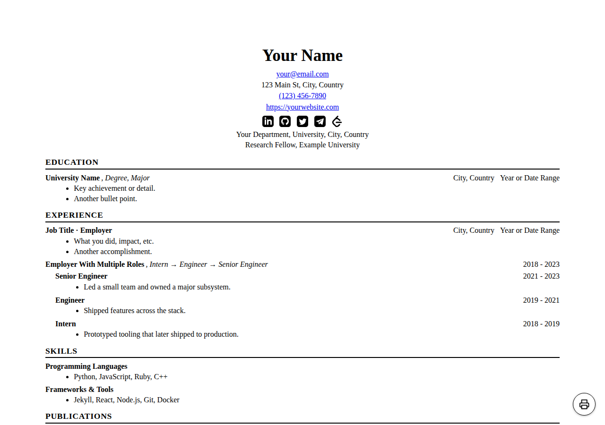

# 🚀 Introducing Harvard-Style Jekyll CV Theme!
Build a CV or résumé with a classic Harvard look. It is customizable, mobile-friendly and ready for GitHub Pages.

This is a fork of [smirnoffmg/harvard-style-cv-theme](https://github.com/smirnoffmg/harvard-style-cv-theme)
by [Maksim Smirnov](https://github.com/smirnoffmg). The layout and styling come from that project.
This copy adds a few features and ships the theme as a gem; [Attribution](#-attribution) lists the changes.

---

## 🚀 Quick Start

There are two ways to use this theme. With either one, create your own
`_config.yml` and `_data/cv.yml` with your information (examples below). The
repository is public, so neither option needs a token or other credentials.

### Option A: as a gem (recommended)

Bundler fetches the theme at a release tag, so every build uses the same version
until you bump it.

`Gemfile`:

```ruby
gem "harvard-style-cv-theme",
    git: "https://github.com/sengine-cloud/harvard-style-cv-theme.git",
    tag: "v2.0.0"
```

`_config.yml`:

```yaml
theme: harvard-style-cv-theme
```

### Option B: as a remote theme

```yaml
remote_theme: sengine-cloud/harvard-style-cv-theme@v2.0.0
```

Tags are listed under [releases](https://github.com/sengine-cloud/harvard-style-cv-theme/releases),
and [CHANGELOG.md](CHANGELOG.md) says what changed in each.

---

## 📝 Configuration Examples

### `_config.yml` - Site Configuration
```yaml
# Basic Information
title: "Dr. Jane Smith"
email: "jane.smith@university.edu"
phone: "(555) 123-4567"
address: "123 Academic Street, Cambridge, MA 02138"
website: "https://janesmith.com"

# Professional Affiliation
department: "Department of Computer Science, Harvard University, Cambridge, MA"
affiliation: "Research Fellow, MIT Computer Science & AI Laboratory"

# Social Media (just usernames, not full URLs)
linkedin: janesmith
github: janesmith
twitter: janesmith
telegram: janesmith
leetcode: janesmith
calendly: janesmith/30min # Calendly booking page: username, or username/event

# Optional: GoatCounter (privacy-friendly; tracks data-goatcounter-click links)
goatcounter: "https://yourcode.goatcounter.com"

# Optional: Tianji (self-hosted; tracks data-tianji-event links)
tianji:
  url: "https://stats.example.com"
  website_id: "your-website-id"

# Optional: Google Analytics
google_analytics: G-XXXXXXXXXX

# Site Settings
description: "Harvard-style CV • Dr. Jane Smith"
baseurl: ""
url: "https://janesmith.github.io"
```

### `_data/cv.yml` - CV Content
```yaml
sections:
  - title: Education
    entries:
      - title: "Harvard University"
        sub: "Ph.D. in Computer Science"
        location: "Cambridge, MA"
        dates: "2018-2023"
        bullets:
          - "Dissertation: 'Advanced Machine Learning Algorithms for Natural Language Processing'"
          - "Advisor: Dr. John Doe"
          - "GPA: 3.9/4.0"
      
      - title: "MIT"
        sub: "M.S. in Computer Science"
        location: "Cambridge, MA"
        dates: "2016-2018"
        bullets:
          - "Thesis: 'Neural Network Optimization Techniques'"
          - "Graduated with distinction"

  - title: Experience
    entries:
      - title: "Research Scientist · Google Research"
        location: "Mountain View, CA"
        dates: "2023-Present"
        bullets:
          - "Lead research on large language models and their applications"
          - "Published 5 papers in top-tier conferences (NeurIPS, ICML)"
          - "Mentored 3 PhD students and 2 research interns"
      
      - title: "Graduate Research Assistant · Harvard University"
        location: "Cambridge, MA"
        dates: "2018-2023"
        bullets:
          - "Developed novel algorithms for natural language understanding"
          - "Collaborated with international research teams"
          - "Presented work at 8 international conferences"

  - title: Publications
    entries:
      - title: "Advanced Neural Architectures for Language Processing"
        sub: "NeurIPS 2023"
        bullets:
          - "Proposed a new transformer variant that improves efficiency by 40%"
          - "Cited 150+ times within 6 months of publication"
      
      - title: "Efficient Training Methods for Large Language Models"
        sub: "ICML 2022"
        bullets:
          - "Developed techniques to reduce training time by 60%"
          - "Open-sourced implementation with 500+ GitHub stars"

  - title: Skills
    entries:
      - title: "Programming Languages"
        bullets:
          - "Python, C++, JavaScript, Rust"
      
      - title: "Machine Learning & AI"
        bullets:
          - "PyTorch, TensorFlow, Transformers, Computer Vision"
      
      - title: "Tools & Platforms"
        bullets:
          - "Git, Docker, AWS, Google Cloud Platform"

  - title: Awards & Honors
    entries:
      - title: "NSF Graduate Research Fellowship"
        dates: "2018-2021"
        bullets:
          - "Prestigious fellowship for outstanding graduate students"
      
      - title: "Best Paper Award"
        sub: "ACL 2022"
        bullets:
          - "Recognized for innovative contributions to NLP field"
```

#### Grouping multiple roles at one employer

An entry may carry a `roles:` list to group several positions held at the same
employer. Each role renders as a nested entry (with its own `title`, `sub`,
`location`, `dates`, and `bullets`):

```yaml
  - title: Experience
    entries:
      - title: "Acme Corp"
        sub: "Intern → Engineer → Senior Engineer"
        dates: "2018 - 2023"
        roles:
          - title: "Senior Engineer"
            dates: "2021 - 2023"
            bullets:
              - "Led a team and owned a major subsystem."
          - title: "Engineer"
            dates: "2019 - 2021"
            bullets:
              - "Shipped features across the stack."
```

---

## ✨ Features

- **Classic Harvard layout** with bold centered name and structured sections
- **Print/PDF friendly** - looks crisp when printed or saved as PDF
- **One-click print button** - a floating printer-icon button opens the browser's print/save-as-PDF dialog (hidden in the printed output itself)

  

  Default and hover/focus (color-inverted) states:

  

- **Responsive design** - perfect on desktop, tablet, and mobile
- **Social integration** - LinkedIn, GitHub, Twitter, Telegram, LeetCode icons, plus a Calendly booking link
- **Easy customization** - manage all content through simple YAML files
- **GitHub Pages ready** - works out of the box with no additional setup
- **SEO optimized** - built-in search engine optimization
- **Semantic versioning** - tagged releases you can pin, with a [changelog](CHANGELOG.md)

---

## 🤝 Contributing

Found a bug or have a feature request? [Open an issue](https://github.com/sengine-cloud/harvard-style-cv-theme/issues) or submit a pull request!

---

## 🙏 Attribution

This is a fork of [`smirnoffmg/harvard-style-cv-theme`](https://github.com/smirnoffmg/harvard-style-cv-theme) by [Maksim Smirnov](https://github.com/smirnoffmg), maintained under the `sengine-cloud` organization. It adds nested roles, GoatCounter and Tianji support, gem packaging, a more compact print layout, a print / save-as-PDF button and a Calendly link; [CHANGELOG.md](CHANGELOG.md) has the details. The original MIT license and copyright notice are kept in [LICENSE](LICENSE).

---

**Ready to create your professional CV?** 🚀

[Use it as a gem or remote theme](#-quick-start) to get started!

